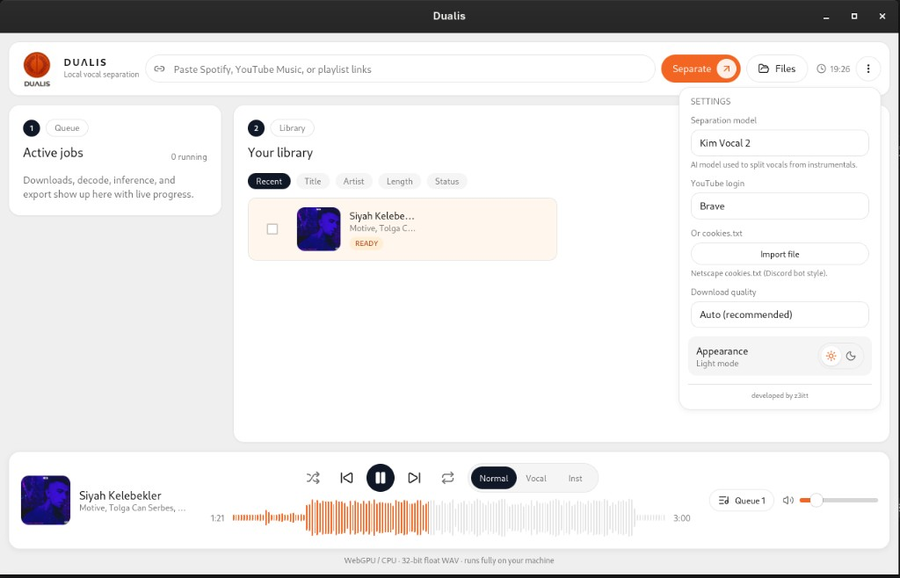
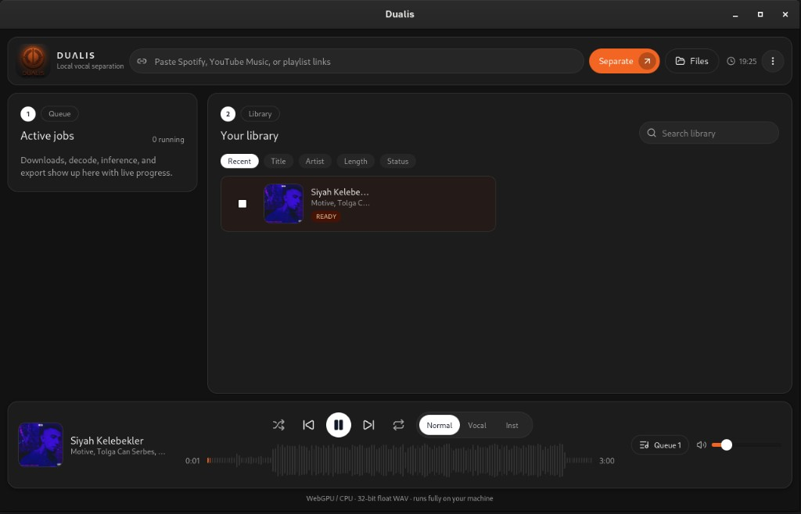
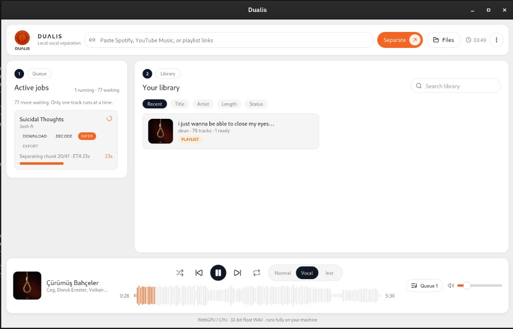
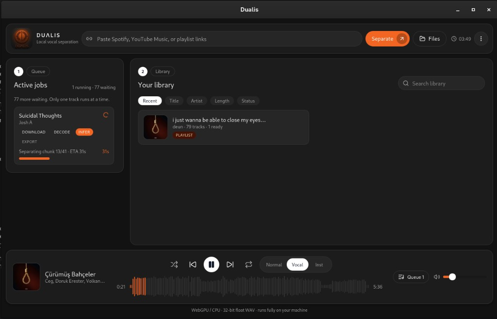
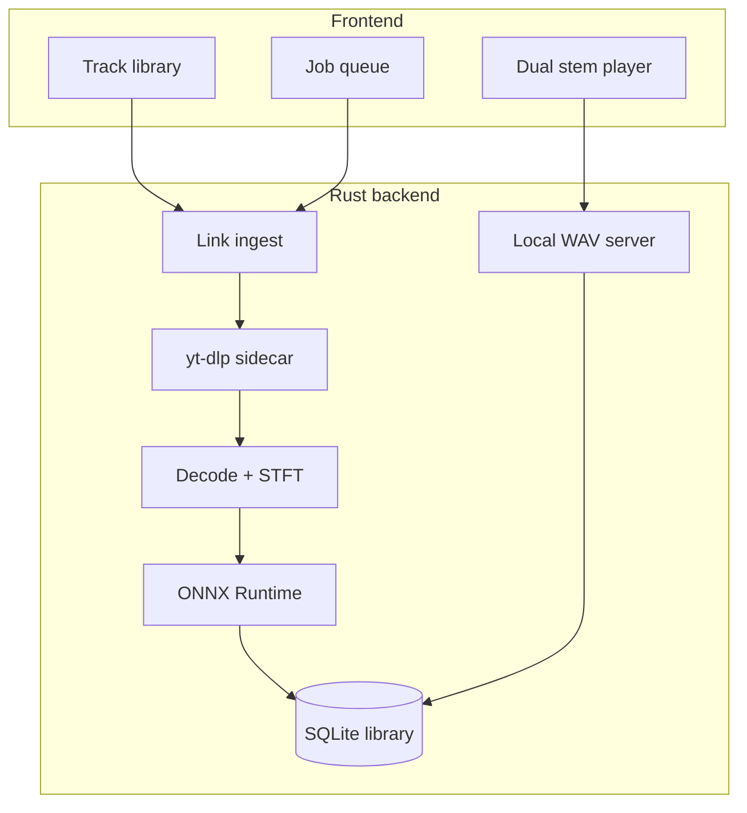

# Dualis

On-device vocal and instrumental stem separation for Linux and Windows.
Paste a Spotify or YouTube Music link, download audio locally, split vocals
from the rest of the mix with ONNX, and play both stems in sync.

[](LICENSE)

| | |
|---|---|
| **Package** | `com.z3itt.dualis` |
| **Version** | `1.0.4` |
| **Platforms** | Linux (AppImage, RPM, DEB), Windows (NSIS `.exe`) |
| **License** | [GPL-3.0-or-later](LICENSE) |

Dualis is free software. You may study, modify, and redistribute it under the
terms of the GNU General Public License v3. See [LICENSE](LICENSE),
[COPYING](COPYING), and [NOTICE](NOTICE).

Separation runs on your machine. Audio is not uploaded to a Dualis server.

## Highlights

- Paste Spotify, YouTube Music, YouTube, or playlist links
- Spotify tracks resolve to YouTube with **title + artist** search
- Playlist ingest queues one job at a time (retry / prioritize supported)
- Local ONNX vocal isolation (Kim Vocal 2 by default)
- Dual-stem player: original, vocals, or instrumental
- Shuffle, queue loop, and song loop
- WebGPU / DirectML when available, CPU fallback on failure
- Cookies from Firefox/Chrome or a `cookies.txt` file for restricted videos

## Screenshots

| Library (light) | Library (dark) |
|-----------------|----------------|
|  |  |

| Job queue (light) | Job queue (dark) |
|-------------------|------------------|
|  |  |

## Architecture

Dualis is a Tauri v2 desktop shell: React UI in the webview, Rust for download,
decode, inference, SQLite, and local stem playback.

```text
┌─────────────────────────────────────────────────────────────┐
│  React + Zustand                                            │
│  Library · playlists · job queue · dual-stem player         │
└───────────────────────────┬─────────────────────────────────┘
                            │ Tauri commands / events
┌───────────────────────────▼─────────────────────────────────┐
│  Rust (dualis_lib)                                          │
│  ingest · yt-dlp sidecar · SQLite · ONNX infer · HTTP WAV   │
└─────────────────────────────────────────────────────────────┘
```



### Key design choices

| Area | Approach |
|------|----------|
| UI | React 19, Tailwind 4, Zustand |
| Shell | Tauri 2, Linux WebKit / Windows WebView2 |
| Download | Bundled `yt-dlp` sidecar, one job at a time |
| Spotify | oEmbed + page scrape, then `ytsearch1:title artist` |
| Separation | ONNX MDX / Roformer models on disk |
| Playback | Local HTTP server of 32-bit float WAVs (two `<audio>` elements) |
| Persistence | SQLite library + `dualis:ui` in localStorage |

## Tech stack

| Layer | Libraries |
|-------|-----------|
| Language | TypeScript, Rust 2021 |
| UI | React 19, Tailwind CSS 4, lucide-react |
| State | Zustand |
| Desktop | Tauri 2, plugins: dialog, opener |
| Audio DSP | Symphonia, realfft, rubato, hound |
| ML | ONNX Runtime 1.x (WebGPU / DirectML / CPU) |
| Download | yt-dlp sidecar |
| Database | rusqlite (bundled SQLite) |

## Privacy

Dualis talks to Spotify oEmbed, YouTube (via yt-dlp), and model download
hosts only when you paste a link or fetch a model. Stems stay under your
app cache (`com.z3itt.dualis`). There is no Dualis cloud account.

YouTube may still require a logged-in browser cookie for some videos. That
cookie stays on your machine.

## Getting started

### Requirements

- Node.js 20+
- Rust stable (`rustup`)
- Linux: WebKitGTK 4.1, GTK 3, OpenSSL, pkg-config  
  Fedora: `webkit2gtk4.1-devel openssl-devel gtk3-devel librsvg2-devel gcc gcc-c++`
- Optional: user-local GTK/WebKit prefix at `~/.local/tauri-sysroot`

### Run (debug)

```bash
git clone https://github.com/z3itt/Dualis.git
cd Dualis
npm install
npm run sidecar
npm run desktop
```

`npm run desktop` wraps `tauri dev` with `TMPDIR` and `pkg-config` so Fedora
builds do not fill `/tmp` or miss GTK.

### Install (release)

Build installers on the same OS you target:

```bash
npm install
npm run sidecar
npm run desktop:build
```

Linux packages land in `src-tauri/target/release/bundle/`:

| Format | File |
|--------|------|
| AppImage | `bundle/appimage/Dualis_1.0.4_amd64.AppImage` |
| DEB | `bundle/deb/Dualis_1.0.4_amd64.deb` |
| RPM | `bundle/rpm/dualis-1.0.4-1.x86_64.rpm` |

After `npm run desktop:build`, finish Linux installers with:

```bash
bash scripts/package-linux.sh
```

Windows NSIS (`-setup.exe`) is built on GitHub Actions (`windows-latest`), not
from this Fedora host. The GNU/MinGW `cargo build --target x86_64-pc-windows-gnu`
path is for plain Rust binaries; Dualis needs the MSVC target, WebView2, and
NSIS.

After a tag, or via **Actions → Windows installer → Run workflow**, the
`-setup.exe` is attached to that GitHub release.

The first stem job downloads the selected ONNX model (Kim Vocal 2 by default,
about 60-80 MB).

### Tests

```bash
npm test
cd src-tauri && cargo test --lib
```

## Project layout

```text
src/                  React UI, player, library, Zustand store
src-tauri/src/        Rust ingest, queue, DSP, ONNX, playback HTTP
src-tauri/icons/      Desktop / dock icons
public/brand/         Dualis lockups (light and dark)
docs/screenshots/     README screenshots
scripts/              tauri-with-env.sh, fetch-sidecars.sh
```

## Models

Pick a model in the header menu:

- **Kim Vocal 2** (MDX, default)
- **UVR MDX Voc FT** (MDX, alternate timbre)
- **BS-Roformer** (waveform ONNX; input shape is read from the file)

GPU out-of-memory falls back to CPU and the job queue shows that retry.

## Contributing

See [CONTRIBUTING.md](CONTRIBUTING.md) for setup, tests, and pull request
guidelines.

## Contact

- **Author:** z3itt
- **Email:** info@z3itt.com
- **Website:** https://z3itt.com
- **Source:** https://github.com/z3itt
